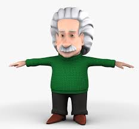
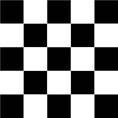
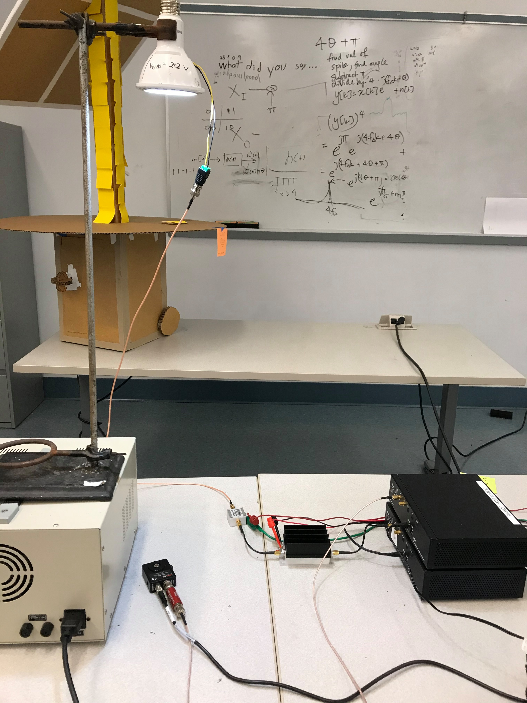

# Introduction to Analog and Digital Final Project, Fall 2019
#### By [Daniel Connolly](https://github.com/djconnolly27), [William Fairman](https://github.com/wFairmanOlin), and [Qingmu Deng](https://github.com/QingmuDeng)

## Wireless Communication with Indoor LED Lightblub
The discovery of high frequency switchings of commercial LED lightbulbs offers a new approach to wireless communication through visible light. In this project we aimed to transmit photos through LED lightbulbs over distance comparable to that of a desktop lamp. Over the course of the project, we ended up producing a wireless system that in the end was able to transmit a `200,000 bit` data packet over a `25in` distance with `2%` accuracy. Our final report can be found [here](ADC_Final_Report_Connolly_Fairman_Deng.pdf).

## Code Description
This repository contains all of the code we used to turn an image into a **4-QAM data packet** as well as turning received data back into an image. The repository also contains examples of transmitted and received data packets located in `\data\`. These files are stored in a binary `.dat` format.

### Processing an Image
All of the image conversion code is found in `ImageQAM.mlx`. Running the tx generation portion of the code will generate a file  `txname.dat` that is ready to transmit over light via gnuradio. Running the rx processing code will look for a file `rxname.dat` and convert that image into a black and white image.

#### Images
The two images we transmitted are located below. While any image can be processed by our code, we recommend using smaller images to keep them within the `200,000` bit data limit.

#### Warnings
Due to some of our received data files having a relatively high error rate, you may have to specify the row width of the received image in order to properly transform `rxname.dat` into an image.

### Transmitting and Receiving
We used  the `gnuradio-companion` gui in Ubuntu to read and write `.dat` and communicate with USRPs to transmit and receive the data. These data files, however, should work on most USRP systems and accompanying software.

## Setup
The physical setup of our project can be seen below. For this lab we used a standard LED bulb you could find at any department store, an avalanche photodetector and low pass filter from ThorLabs, a voltage bias and signal amplifier to move the signal into a linear regime acceptable for the lightbulb, and two USRPs to transmit and receive our `.dat` over a QPSK signal.

